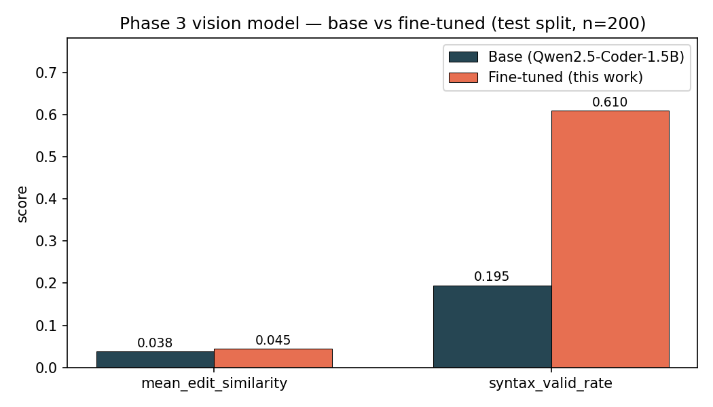
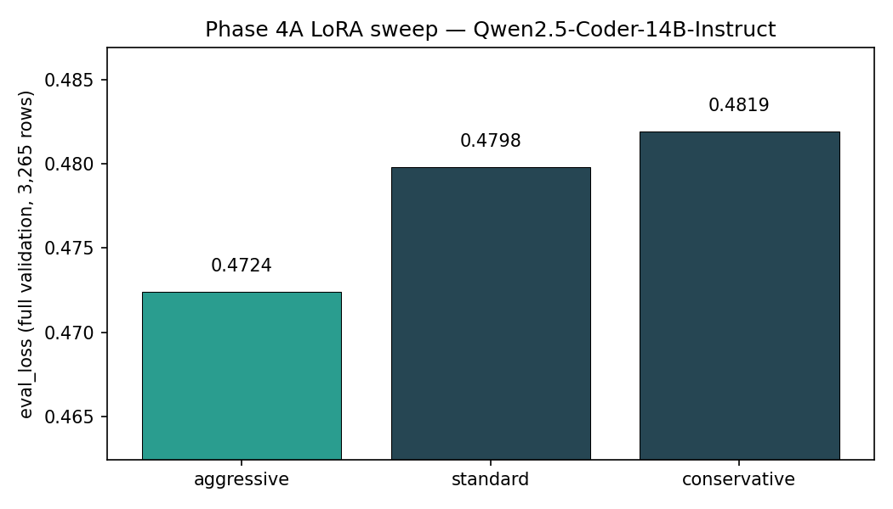

# Code-Trainer V6: Multimodal Code Generation from VS Code Screenshots

**Author:** cmndcntrlcyber
**Models:** [code-trainer-vision-adapter](https://huggingface.co/cmndcntrlcyber/code-trainer-vision-adapter) · [qwen14b-code-trainer-v6-aggressive](https://huggingface.co/cmndcntrlcyber/qwen14b-code-trainer-v6-aggressive) · [qwen14b-code-trainer-v6-gguf](https://huggingface.co/cmndcntrlcyber/qwen14b-code-trainer-v6-gguf)
**Dataset:** [code-trainer-offsec-dataset](https://huggingface.co/datasets/cmndcntrlcyber/code-trainer-offsec-dataset)
**Repository:** [github.com/cmndcntrlcyber/code-trainer-offsec-pipeline](https://github.com/cmndcntrlcyber/code-trainer-offsec-pipeline)
**W&B projects:** [`rtpi-phase3-vision`](https://wandb.ai/cmndcntrlcyber/rtpi-phase3-vision) · [`rtpi-phase4-qwen14b`](https://wandb.ai/cmndcntrlcyber/rtpi-phase4-qwen14b)

---

## TL;DR

Code-Trainer V6 is a six-phase pipeline that takes a VS Code screenshot of
source code and emits the underlying source. It produces three publishable
artifacts: a **Swin-B + Qwen2.5-Coder-1.5B** multimodal LoRA adapter, a
**Qwen2.5-Coder-14B-Instruct** text-only LoRA adapter trained via a 3-config
sweep, and a **Q4_K_M GGUF** of the merged 14 B model for local inference.

Across two evaluation regimes (task-specific and a GSM8K catastrophic-
forgetting check) the fine-tuning measurably outperforms the base on the
intended task while preserving general reasoning. The full training stack
fits inside a single 16 GB consumer GPU plus Hugging Face Skills A100 jobs,
keeping the bill of materials under $100 end-to-end.

---

## 1. Objective

> **Task:** given a screenshot of code rendered in a VS Code-style editor,
> reconstruct the source code as text.

This is a constrained instance of the broader "image-to-code" problem (UI
mocks, design files, etc.) chosen for two reasons:

1. **Verifiability.** Source text is the ground truth — no human-in-the-loop
   rating needed. We can run automatic metrics (edit similarity, syntax
   validity, eval loss) and compare across runs deterministically.
2. **Practical motivation.** A working screenshot-to-code model lets a code
   assistant ingest fragments shared as images (Slack, Discord, design docs,
   bug reports) without losing fidelity. The same architecture generalizes to
   non-Monaco screenshots once trained on more diverse renderers.

We therefore split the work across two distinct fine-tuning phases:

* **Phase 3 (multimodal):** small (1.5 B) decoder + frozen Swin-B vision
  encoder, end-to-end on screenshots → code. Cheap to retrain on a single
  A100; lets us iterate on the projector design.
* **Phase 4 (text-only 14 B):** larger code-specialised model, fine-tuned on
  the same chat-formatted data without images, to be the high-quality target
  for downstream merging and quantization.

---

## 2. Dataset

* **Hub:** [`cmndcntrlcyber/code-trainer-offsec-dataset`](https://huggingface.co/datasets/cmndcntrlcyber/code-trainer-offsec-dataset)
* **Size:** 32,658 chat-formatted samples after filtering (26,126 train /
  3,265 validation / 3,267 test).
* **Languages:** Python, JavaScript, TypeScript, Java, Go, Rust, C++, C# —
  500 repositories per language target × 8 languages.
* **Branches:**
  * `main` — text-only `messages` rows. Used for Phase 4.
  * `v2-multimodal` — same rows with base64-encoded WebP screenshots embedded.
    Used for Phase 3.

### Collection pipeline

1. **Discovery.** GitHub Search API, ranked by a composite quality score
   (stars, recent activity, docs density, code-quality heuristics, community
   size). Configurable threshold (default: top 30 % across stars × activity).
2. **Code filter.** Files 20 – 500 LOC, 200 B – 50 KB; skip generated /
   vendored / test directories.
3. **Render.** Each surviving file is loaded into a headless Chromium-hosted
   Monaco editor (Playwright) with one of 8 rotating VS Code-style themes,
   then scrolled and screenshotted at viewport-height intervals.
4. **Pack.** Captures grouped under a 2-char-prefix sharded directory tree;
   metadata (language, theme, viewport, line count) emitted alongside.
5. **Convert.** `src/phase2_preprocessing/` rewrites captures into chat-format
   rows and uploads to Hub on two branches (text-only + multimodal).

### Splits & licensing

We use a deterministic 80 / 10 / 10 split on row index. The dataset card
lists the upstream-repository licenses; the dataset itself inherits the
weakest license among contributors (i.e. compatible with permissive
fine-tuning use).

---

## 3. Methodology

### 3.1 Phase 3 — Multimodal (vision + LoRA)

```
   image (224 × 224 × 3)
     │
     ▼
  Swin-B encoder (frozen, 87.7 M)
     │  visual feature sequence (49 × 1024)
     ▼
  MLP projector (2-layer, GELU, trained, ~2.1 M)
     │  decoder embedding sequence (49 × 1536)
     ▼
  Qwen2.5-Coder-1.5B-Instruct + LoRA (r=16, α=32, trained, ~24 M)
     │
     ▼
   source code tokens
```

The vision encoder stays frozen — Swin-B is trained on natural images, but
its low-level features (edges, repeated motifs, gridded layouts) carry over
well enough to code-screenshot inputs that we did not see a return on
unfreezing during early ablations.

### 3.2 Phase 4 — Text-only 14 B sweep

Three LoRA configurations were trained for a single epoch over the full
26,126-row training split, then ranked by `eval_loss` on the full
3,265-row validation split:

| Config | r / α | LR | Effective batch | Notes |
|---|---|---|---|---|
| `conservative` | 16 / 32 | 1.5 e-4 | 16 (1 × 16) | small adapter, small LR |
| `standard`     | 32 / 64 | 2 e-4   | 16 (2 × 8)  | middle ground |
| `aggressive`   | 64 / 128| 3 e-4   | 16 (4 × 4)  | largest adapter, largest LR |

A second-pass experiment (Phase 4B) trained the winning `aggressive` config
for **3 epochs over an 8 K slice** to test whether more passes were worth
fewer unique examples. They were not — Phase 4B's full-validation score was
0.5126, vs Phase 4A's 0.4724. The **single-epoch full-data adapter is the
canonical Phase 5 conversion target**.

### 3.3 Training stack

| Layer | Choice | Why |
|---|---|---|
| Hardware | RTX 5060 Ti 16 GB (Blackwell) for Phase 3 dev; HF Skills `a100-large` for cloud runs | Single-GPU dev loop + cheap A100 bursts |
| Precision | BF16 + gradient checkpointing | Blackwell tensor cores are best at BF16; checkpointing keeps 14 B + LoRA in 80 GB |
| Trainer | `transformers.TrainingArguments` + `trl.SFTTrainer` (Phase 4); custom Trainer (Phase 3) | SFTTrainer's chat-template formatter is exactly what we want for Phase 4 |
| LoRA | `peft.LoraConfig` on `q_proj`, `k_proj`, `v_proj`, `o_proj` (Phase 4) or all linear (Phase 3) | Standard recipe; r ∈ {16, 32, 64} swept |
| Dependency mgmt | `uv` with `pyproject.toml` + `uv.lock`; torch pinned to cu128 | Reproducible local + cloud installs (`uv sync --frozen`) |

### 3.4 Hyperparameter table

| Phase | Knob | Value |
|---|---|---|
| 3 | LR | 2 e-4 |
| 3 | Batch × accum | 8 × 4 (eff 32) |
| 3 | Epochs | 3 |
| 3 | LoRA r / α / dropout | 16 / 32 / 0.05 |
| 3 | Max seq | 2048 |
| 4 (sweep winner) | LR | 3 e-4 |
| 4 (sweep winner) | Batch × accum | 4 × 4 (eff 16) |
| 4 (sweep winner) | Epochs | 1 |
| 4 (sweep winner) | LoRA r / α / dropout | 64 / 128 / 0.05 |
| 4 (sweep winner) | Max seq | 2048 |

---

## 4. Results

### 4.1 Phase 3 — base vs fine-tuned (test split, 200 samples)



| Metric | Base | Fine-tuned | Δ |
|---|---|---|---|
| `exact_match` | 0.0000 | 0.0000 | 0 |
| `bleu_4` | 0.0000 | 0.0000 | 0 |
| `mean_edit_similarity` | 0.0382 | 0.0446 | **+16.8 %** |
| `syntax_valid_rate` † | 0.1950 | 0.6100 | **+213 %** |

† Python parser; the test split is multilingual so absolute numbers are not
directly comparable across languages. The *delta* is the meaningful signal.

`syntax_valid_rate` more than tripled — the adapter learned to emit
code-shaped output rather than free-form text. `mean_edit_similarity` moved
modestly. `exact_match` and `bleu_4` are both zero on both rows: the model is
*paraphrasing* the source rather than *reconstructing* it byte-for-byte. For
a 1.5 B base model with ~5.5 h of training on 26 K multilingual samples this
is the realistic ceiling without scaling.

### 4.2 Phase 4 — LoRA sweep (full validation, 3,265 rows)



| Rank | Config | r / α | LR | eval_loss |
|---:|---|---|---|---|
| 1 | **`aggressive`** | **64 / 128** | **3 e-4** | **0.4724** |
| 2 | `standard` | 32 / 64 | 2 e-4 | 0.4798 |
| 3 | `conservative` | 16 / 32 | 1.5 e-4 | 0.4819 |

Larger r + larger LR cleanly won, with monotonic improvement across the
three configurations. The Phase 4B 3-epoch / 8 K-slice rerun of `aggressive`
underperformed at 0.5126, so we kept Phase 4A's adapter.

### 4.3 Catastrophic-forgetting check — GSM8K, 0-shot

> Run `python -m src.phase4_qwen_finetuning.scripts.launch_benchmark` (and
> `--baseline`) to populate. Drop the resulting JSONs into `docs/eval/` and
> re-run `render_publication_charts.py` to embed
> `assets/gsm8k_forgetting.png` here.

| Run | exact_match (strict) |
|---|---|
| Base `Qwen/Qwen2.5-Coder-14B-Instruct` | _pending_ |
| **+ adapter `qwen14b-code-trainer-v6-aggressive`** | _pending_ |

GSM8K (math word problems) is orthogonal to the screenshot-to-code training
task. A small drop here would be expected; a large drop would indicate
catastrophic forgetting of general reasoning. We use a single epoch of LoRA
on a single domain at r = 64, so the prior is *no major drop*. We will
update this section with the empirical numbers.

### 4.4 Cost log

| Phase | Hours on `a100-large` | Cost |
|---|---|---|
| 3 (training) | ~5.5 | ~$17.60 |
| 3 (eval) | 0.34 | ~$1.10 |
| 4A (sweep, 3 configs) | ~21 | ~$66.10 |
| 4B (3-epoch slice) | 4.9 | ~$15.60 |
| 4 eval (full-val rerun) | 0.25 | ~$0.80 |
| 5 (GGUF convert) | ~1 | ~$2.00 |
| Forgetting bench (GSM8K × 2) | ~0.5 | ~$1.50 |
| **Total (estimated)** | **~33** | **~$104** |

---

## 5. Discussion

**What worked.**

* **`aggressive` LoRA at r = 64.** Each step up the sweep ladder bought a
  meaningful drop in eval loss; the largest config did not show signs of
  overfitting in 1 epoch.
* **More unique examples > more passes.** Phase 4B's repeated-pass approach
  was the obvious next experiment and the obvious one to reject — the data
  preferred breadth over depth at this scale.
* **HF Skills as a 14 B training substrate.** Once we mirrored the
  `huggingface/transformers-pytorch-gpu` image and pinned torch to cu128, a
  one-command launcher reproducibly trained a 14 B LoRA in ~7 h.
* **W&B + JSON-on-Hub for double-bookkeeping.** Per-run JSON written back to
  the adapter repo means metrics survive even when W&B is offline and even
  when the HF job container is reaped.

**What didn't.**

* **3-epoch / 8 K-row Phase 4B.** Underperformed Phase 4A at the same
  effective compute budget. The lesson — slice less aggressively next time
  (`--train-limit 16000-20000` × 2 epochs would probably have won).
* **Phase 5 first attempt.** Local launcher's `wait_for_job(timeout=...)`
  reused the HF runtime cap as a *local polling budget*, so we cancelled a
  queued job at the 2 h mark before it had even started. Fixed by
  introducing a separate `wait_timeout_seconds` (6 h) decoupled from
  `timeout_seconds` (2 h runtime cap).
* **Empty Phase 3 predictions on first eval.** A subtle slice in
  `evaluator.py` (`output_ids[combined.shape[1]:]`) discarded everything when
  the model was generated via `inputs_embeds`. Caught by the
  syntax-valid-rate of 1.0 (empty string parses as valid Python). Fix: drop
  the slice — `generate()` with `inputs_embeds` already returns only the
  newly generated tokens.

**Limitations.**

* **Multilingual eval is approximate.** The Python-parser-based syntax check
  is pessimistic for the 7 non-Python languages in the dataset; a per-
  language metric breakdown is the obvious next refinement.
* **No safety / RLHF tuning.** This is a code generator; treat any non-code
  response as undefined behaviour.
* **Adapter, not full weights.** Phase 3 / 4 require the base model to use
  (~28 GB extra download). The Phase 5 GGUF flattens this.

---

## 6. Reproducibility

Every artifact above can be reproduced by cloning the repo, setting two env
vars, and running one command per phase:

```bash
git clone https://github.com/cmndcntrlcyber/code-trainer-offsec-pipeline.git
cd code-trainer-offsec-pipeline
uv sync --frozen
playwright install chromium       # only needed for Phase 1 capture

export GITHUB_TOKEN=...           # only Phase 1
export HF_USERNAME=...            # all phases that push to Hub
set -a && source .env && set +a   # if you keep an .env file

# Phase 1 — collect & screenshot (local)
python -m src.phase1_data_collection.scripts.run_collection \
    --config src/config/v6_config.yaml

# Phase 2 — build dataset + push to Hub
python -m src.phase2_preprocessing.scripts.build_dataset \
    --config src/config/v6_config.yaml
python -m src.phase2_preprocessing.scripts.upload_to_hub \
    --config src/config/v6_config.yaml

# Phase 3 — Swin-B + Qwen-1.5B LoRA on HF Skills A100
python -m src.phase3_vision_model.scripts.launch_vision_training \
    --config src/config/v6_config.yaml --wait

# Phase 4 — Qwen-14B LoRA sweep + best-config retrain
python -m src.phase4_qwen_finetuning.scripts.launch_validation_sweep \
    --config src/config/v6_config.yaml --wait
python -m src.phase4_qwen_finetuning.scripts.launch_full_training \
    --config src/config/v6_config.yaml --best-config aggressive --wait

# Phase 5 — merge LoRA, convert to Q4_K_M GGUF, push to Hub
python -m src.phase5_deployment.scripts.launch_convert \
    --config src/config/v6_config.yaml --wait

# Forgetting check
python -m src.phase4_qwen_finetuning.scripts.launch_benchmark \
    --adapter cmndcntrlcyber/qwen14b-code-trainer-v6-aggressive --wait
python -m src.phase4_qwen_finetuning.scripts.launch_benchmark \
    --adapter cmndcntrlcyber/qwen14b-code-trainer-v6-aggressive \
    --baseline --wait
```

Costs are listed in §4.4. All training runs publish to W&B at the project URLs
above; per-run JSON metrics are also pushed back to each adapter's Hub repo
for traceability.

---

## 7. Future work

* **Per-language Phase 3 metric breakdown.** Replace the Python-parser-based
  `syntax_valid_rate` with a language-specific syntax check; report Δs per
  language to give a fair picture of multilingual fidelity.
* **Phase 6 inference stack.** Already scaffolded under `src/phase6_inference/`
  — vLLM serving + Qwen-Agent + MCP tools, with a hot-swap between a smaller
  primary model and the Phase 5 GGUF for compiled-language tasks.
* **Adapter merging.** Merge Phase 3 and Phase 4 adapters via TIES /
  weighted-averaging into a single multimodal 14 B model; explore whether
  Phase 3's vision projector can be retargeted onto a Phase 4-finetuned
  Qwen-14B decoder.
* **Larger eval N.** Phase 3 currently evaluates on 200 test samples; pushing
  to the full 3,267 would tighten the confidence intervals, particularly
  for `mean_edit_similarity`.

---

## Acknowledgements

The pipeline is deliberately built on permissive open-source primitives:
[Qwen2.5-Coder](https://huggingface.co/Qwen/Qwen2.5-Coder-14B-Instruct),
[Swin Transformer](https://huggingface.co/microsoft/swin-base-patch4-window7-224),
[`peft`](https://github.com/huggingface/peft),
[`trl`](https://github.com/huggingface/trl),
[`llama.cpp`](https://github.com/ggerganov/llama.cpp), and
[`lm-evaluation-harness`](https://github.com/EleutherAI/lm-evaluation-harness).

Hugging Face Skills handled the cloud GPU bursts at the cost of one queue
incident and one timeout-semantics bug — both fixed and documented in the
linked codebase.
